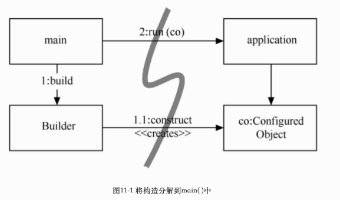
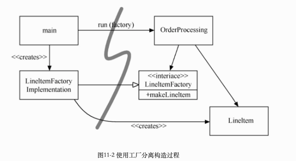
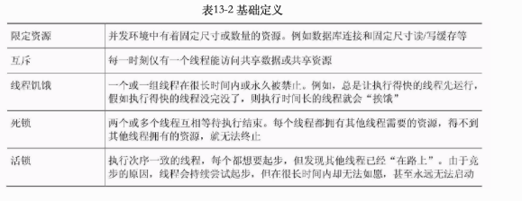

## 沉迷测试（Test Obsessed）


## 第一章 整洁代码

***later equals never***：稍后等于永不

***整洁的代码只做好一件事情***

​	*每个函数，每个类，每个模块都全神贯注于一事情， 整洁的代码应该可由作者之外的开发者阅读和增补，应该包含有单元测试和验收测试。只提供一种而非多种做一件事的途径，只有尽量少的依赖关系，明确的定义和尽量少的API*

**童子军军规**：

​	*让营地比你来时更干净；如果每次签入的时候，代码都比签出时干净，那么代码就不会腐坏*


## 第二章 有意义的命名

**名副其实：**

​	如果名称需要注释来补充，那就不算名副其实了

**做有意义的区分**

​	废话是另一种没意义的区分。假如有一个Product类，如果还有一个ProductData/ProductInfo类，那他们的名称虽然不同，意思却相同，Info/Data就像a一样，是意义含混的废话


## 第三章 函数

### 短小

函数的第一规则是要短小，第二规则还是要短小

每个函数只做一件事情，做好一件事

if,else,while语句等，其中的代码块应该只有一行，该行大抵应该是一个函数调用语句

### 只做一件事

*如果函数只是做了该函数名下同一抽象层上的步骤，则函数还是只做了一件事，因此要确保函数只做一件事情的话，函数中的语句都要在同一个抽象层级上面*

### Switch语句

```java
public Money calculatePay(Employee e) throws InvalidEmployeeType{
  switch(e.type){
      case COMMISSIONED:
					return calculateCommissionedPay(e);
			case HOURLY:
					return calculateHourlyPay(e);
			case SALARIED:
					return calculateSalariedPay(e);
			default:
					throw new InvalidEmployeeType(e.type);
  }
}
```

此函数存在的问题是：

1. 首先，它太长，当出现新的雇员类型时，会更长

2. 其次，做了明显不止一件事情

3. 违反了单一权责原则（SRP），因为有好几个修改它的理由
4. 违反了开放闭合原则（OCP），每当添加一个新类型，就必须修改
5. 最麻烦的是，可能存在多个地方，会有相似的switch的type的判断，如方法isPayday()

该问题解决方案为：

​	将switch*语句埋在抽象工厂底下，不让任何人看到，该工厂使用switch语句为Employee的派生类创建适合的实体，其他的函数藉由Employee接口多态的接受派遣*

​	对于switch语句，如果只是出现一次，用于创建多态对象，而且隐藏在某个继承关系中，在系统其他的部分看不到，就还可以忍受。

整理后代码如下：

```java
public abstract class Employee{
  public abstract boolean isPayday();
  public abstract Money calculatePay();
}
------------
public interface EmployeeFactory{
  public Employee makeEmployee(EmployeeRecord r) throws InvalidEmployeeType;
}
------------
public class EmployeeFactoryImpl implements EmployeeFactory{
  public Employee makeEmployee(EmployeeRecord r) throws InvalidEmployeeType{
    switch(r.type){
        case COMMISSIONED:
					return calculateCommissionedPay(r);
				case HOURLY:
					return calculateHourlyPay(r);
				case SALARIED:
					return calculateSalariedPay(r);
				default:
					throw new InvalidEmployeeType(r.type); 
    }
  }
}
```

### 函数参数

***最理想的参数数量是0，其次是1，再次是2，应尽量避免3，有足够特殊的理由才能使用3个以上的参数，所以无论如何也不要这么做***

从单元测试的角度看，参数叫人为难，因为参数越多，需要测试的参数组合就越多

输出参数比输入参数还要让人难以理解，读函数时，我们惯于认为信息通过参数输入函数，通过返回值从函数中输出。我们不太期望信息通过参数输出。应避免使用输出参数。如果函数必须要修改某种状态，就修改所属对象的状态吧。（**这里的意思就是说通过函数修改了其参数的内容**）

#### 标识参数（Boolean）

标识参数丑陋不堪。向函数传入布尔值简直就是骇人听闻的做法。这样做，方法签名立刻变得复杂起来，大声宣布本函数不止做一件事。如果标识为true将会这样做，标识为false则会那样做！

#### 参数对象

如果函数看来需要三个或者三个以上的参数，就说明其中一些参数应该封装为class了。

#### 无副作用

副作用是一种谎言。函数承诺只做一件事，但还是会做其他被藏起来的事。有时，它会对自己类中的变量做出未能预期的改动。有时，它会把变量搞成向函数传递的参数或是系统全局变量。无论哪种情况，都是具有破坏性的，会导致古怪的时序性耦合及顺序依赖。

如下函数：该函数使用标准算法来匹配 userName和password。如果匹配成功，返回 true，如果失败则返回 false。但它会有副作用

```java
public class UserValidator {
		private Cryptographer cryptographer;
		public boolean checkPassword(String userName, String password) {
				User user = UserGateway.findByName(userName);
				if (user != User.NULL) {
						String codedPhrase = user.getPhraseEncodedByPassword();
						String phrase = cryptographer.decrypt(codedPhrase, password);
						if ("Valid Password".equals(phrase)) {
								Session.initialize();
								return true;
						}
				}
				return false;
		}
}
```

这里副作用就在于对Session.initialize( )的调用。checkPassword函数，顾名思义，就是用来检查密码的。该名称并未暗示它会初始化该次会话。所以，当某个误信了函数名的调用者想要检查用户有效性时，就得*<font color="red">冒抹除现有会话数据的风险</font>*

### 分隔指令和询问

函数要么做什么事，要么回答什么事，二者不可兼得，就像上面的那样。

```java
public boolean set(String attribute, String value);
```

“该函数设置某个指定属性，如果成功就返回true，如果不存在那个属性则返回false。这样就导致了以下语句：

```java
if (set("username", "unclebob"))...
```

从读者的角度考虑一下吧。这是什么意思呢？它是在问username属性值是否之前已设置为unclebob吗？或者它是在问username属性值是否成功设置为unclebob呢？

真正的解决方案是把指令与询问分隔开来，防止混淆的发生：

```java
if (attributeExists("username")) {
		setAttribute("username", "unclebob");
}
```

### 使用异常替代返回错误码

```java
if (deletePage(page) == E_OK) {
		if (registry.deleteReference(page.name) == E_OK) {
			if (configKeys.deleteKey(page.name.makeKey()) == E_OK){
					logger.log("page deleted");
			} else {
				logger.log("configKey not deleted");
			}
		} else {
			logger.log("deleteReference from registry failed");
		}
} else {
	logger.log("delete failed");
	return E_ERROR;
}
```

错误码会导致更深层次的嵌套的结构。当返回错误码的时候，就是在要求调用者立刻处理错误。

如果使用异常替代返回错误码，错误处理代码就能从主路径代码中分离出来，得到简化：

```java
try{
	deletePage(page);
	registry.deleteReference(page.name);
	configKeys.deleteKey(page.name.makeKey);
}catch(Exception e){
	logger.log(e.getMessage());
}
```

#### 抽离try/catch代码块

try/catch代码块丑陋不堪，她们扰乱了代码结构，把错误处理与正常流程混为一谈。因此最好把try和catch代码块的主体部分抽离出来，另外形成函数

```java
try{
  deletePageAndAllReferences(page);
}catch(Exception e){
  logError(e);
}
```

#### 错误处理就是一件事

函数只做一件事情，错误处理就是一件事。<font color="red">***如果try在某个函数中存在，它就该是这个函数的第一个单词，而且在catch/finally代码块后面也不该有其他的内容***</font>

#### 别重复自己

## 第四章 注释

***别给糟糕的代码加注释-重新写吧***

每当要写注释的时候，看看能不能使用代码来表达意思

注释不能美化糟糕的代码，用代码来阐述注释的意思

能使用函数或者变量来表示意思时就别用注释

注释掉的代码：导致其他人不敢删除代码，我们删除掉即可，通过git他们丢不了

## 第五章 格式

## 第六章 对象和数据结构

***变量设置成私有的理由：我们不想别人依赖这些变量，不要直接给变量设置赋值器和取值器，如同它们根本就是公共变量一样***

### 数据抽象

隐藏实现并非只是在变量之间放上一个函数层那么简单。隐藏关乎抽象，类并不简单地用取值器和赋值器将其变量推向外间，而是曝露抽象接口，以便用户无需了解数据的实现就能操作数据本体。

如下：你能确定前者里面都是些变量存取器，而却无法得知后者中的数据形态。

```java
public interface Vehicle{
	double getFuelTankCapacityInGallons();
	double getGallonsOfGasoline();
}
```

```java
public interface Vehicle {
	double getPercentFuelRemaining();
}
```

要以最好的方式呈现某个对象包含的数据，<font color="red">需要做严肃的思考，傻乐着加 取/赋值器，是最坏的选择</font>

### 数据 对象反对称性

对象把数据隐藏于抽象之后，曝露操作数据的函数。数据结构曝露其数据，没有提供有意义的函数

***过程式代码(使用数据结构的代码)便于在不改动既有数据结构的前提下添加新函数；面向对象代码；便于在不改动既有函数的前提下添加新类***

或者说：过程式代码难以添加新数据结构，因为必须修改所有函数。面向对象代码难以添加新函数，因为必须修改所有类。

在任何一个复杂系统中，都会有需要添加新数据类型而不是新函数的时候。这时，对象和面向对象就比较适合。另一方面，也会有想要添加新函数而不是数据类型的时候。在这种情况下，过程式代码和数据结构更合适。

### 得墨忒耳律

***模块不应当了解它所操作的对象的内部的情形***， 这意味着对象不应当通过存取器暴露其内部结构

类C的方法f函数只应该调用**以下对象**的方法

- C

- 由f创建的对象

- 作为参数传递给f的对象

- 由C的实体变量持有的对象

方法不应该调用任何函数返回的对象的方法。换言之，只跟朋友交谈，不与陌生人交谈

**火车头失事**

```java
final String outputDir = ctxt.getOptions().getScratchDir().getAbsolutePath();
```

违反得墨忒耳律，这类代码常被称作火车失事，因为它看起来就像是一列火车。这类连串的调用通常被认为是肮脏的风格，应该避免

*如果ctxt、Options和ScratchDir只是数据结构，没有任何行为，则它们自然会曝露其内部结构，**得墨忒耳律也就不适用了***

**隐藏结构**

上面的火车失事的代码，可以查看下最后取得outputDir是需要干嘛的，可以考虑取的outputDir后操作的代码放在ctxt对象中，这样就可以避免了，例如

```java
BufferedOutputStream bos = ctxt.createScratchFileStream(classFileName);
```

### 数据传送对象

最为精练的数据结构，是一个只有公共变量、没有函数的类。这种数据结构有时被称为数据传送对象，或DTO（Data Transfer Objects）。DTO是非常有用的结构。

更常见的是如下代码所示的“豆”（bean）结构。豆结构拥有由赋值器和取值器操作的私有变量。对豆结构的半封装会让某些OO纯化论者感觉舒服些，不过通常没有其他好处。

```java
public class Address {
  private String street;

  public Address(String street) {
    this.street = street;
	}
  public String getStreet() {
  	return street;
	}
}
```

### 小结

对象曝露行为，隐藏数据。便于添加新对象类型而无需修改既有行为，同时也难以在既有对象中添加新行为。数据结构曝露数据，没有明显的行为。便于向既有数据结构添加新行为，同时也难以向既有函数添加新数据结构。

## 第七章 错误处理

**错误处理很重要，但是如果搞乱了代码的逻辑，就是错误的做法**

### 使用异常而非返回码

### 先写try-catch-finally语句

下面是一个测试驱动开发的例子：

先写一个单元测试，其中显示当文件不存在时将得到一个异常：

```java
@Test(expected = StorageException.class)
public void retrieveSectionShouldThrowOnInvalidFileName() {
sectionStore.retrieveSection("invalid - file");
}
```

该测试驱动我们创建以下占位代码：

```java
public List<RecordedGrip> retrieveSection(String sectionName) {
  // dummy return until we have a real implementation
  return new ArrayList<RecordedGrip>();
}
```

测试失败了，因为以上代码并未抛出异常。下一步，修改实现代码，尝试访问非法文件。该操作抛出一个异常：

```java
public List<RecordedGrip> retrieveSection(String sectionName) {
  try {
  	FileInputStream stream = new FileInputStream(sectionName)
  } catch (Exception e) {
  	throw new StorageException("retrieval error", e);
  }
  return new ArrayList<RecordedGrip>();
}
```

这次测试通过了，因为我们捕获了异常。此时，我们可以重构了。我们可以缩小异常类型的范围，使之符合FileInputStream构造器真正抛出的异常，即FileNotFoundException：

```java
public List<RecordedGrip> retrieveSection(String sectionName) {
  try {
    FileInputStream stream = new FileInputStream(sectionName);
    stream.close();
  } catch (FileNotFoundException e) {
    throw new StorageException("retrieval error", e);
  }
  return new ArrayList<RecordedGrip>();
}
```

如此一来，我们就用try-catch结构定义了一个范围，可以继续用测试驱动（TDD）方法构建剩余的代码逻辑。

### 使用不可控异常

可控异常：每个方法的签名都列出它可能传递给调用者的异常。而且，这些异常就是方法类型的一部分。如果签名与代码实际所做之事不符，代码在字面上就无法编译

可控异常的代价是违反了开放/闭合原则。如果你在方法中抛出可控异常，而catch语句在三个层级之上，你就得在catch语句和抛出异常处之间的每个方法签名中声明该异常

如果你在编写一套关键代码库，则可控异常有时也会有用：你必须捕获异常。但对于一般的应用开发，其依赖成本要高于收益。

### 依调用者需要定义异常类

查看下面的一段代码

```java
ACMEPort port = new ACMEPort(12);
try {
	port.open();
} catch (DeviceResponseException e) {
  reportPortError(e);
  logger.log("Device response exception", e);
} catch (ATM1212UnlockedException e) {
  reportPortError(e);
  logger.log("Unlock exception", e);
} catch (GMXError e) {
  reportPortError(e);
  logger.log("Device response exception");
} finally {
	…
}
```

语句包含了一大堆重复代码，这并不出奇。在大多数异常处理中，不管真实原因如何，我们总是做相对标准的处理。我们得记录错误，确保能继续工作. 

优化成这样

```java
LocalPort port = new LocalPort(12);
try {
  port.open();
} catch (PortDeviceFailure e) {
  reportError(e);
  logger.log(e.getMessage(), e);
} finally {
	…
}

public class LocalPort {
  private ACMEPort innerPort;
  public LocalPort(int portNumber) {
  	innerPort = new ACMEPort(portNumber);
  }
  public void open() {
    try {
    	innerPort.open();
    } catch (DeviceResponseException e) {
      throw new PortDeviceFailure(e);
    } catch (ATM1212UnlockedException e) {
    	throw new PortDeviceFailure(e);
    } catch (GMXError e) {
      throw new PortDeviceFailure(e);
    }
  }
  …
}
```

这里LocalPort是一个简单的打包类

**实际上，将第三方API打包是一个良好的实践手段，当你打包一个第三方api的时候，就降低了对它的依赖，未来你可以不太痛苦地改用其他代码库。在你测试自己的代码时，打包也有助于模拟第三方调用**

### 别返回null值

特例模式：**创建一个类或配置一个对象，用来处理特例，客户代码就不用处理异常行为了，异常行为就封装在特例对象中了**

 如果你打算在方法中返回null值，***不如抛出异常，或是返回特例对象***。如果你在调用某个第三方API中可能返回null值的方法，可以考虑用新方法打包这个方法，在新方法中抛出异常或返回特例对象。

### 别传递null值

在方法中返回null值是糟糕的做法，但将null值传递给其他方法就更糟糕了。除非API要求你向它传递null值，否则就要尽可能避免传递null值

在大多数编程语言中，没有良好的方法能对付由调用者意外传入的null值。事已如此，恰当的做法就是禁止传入null值。

## 第八章 边界

### 使用第三方代码

如下使用的是java 的Map的代码

```java
Map<Sensor> sensors = new HashMap<Sensor>();
...
Sensor s = sensors.get(sensorId );
```

意味着当到Map的接口被修改时，有许多地方都要跟着改。你或许会认为这样的改动不太可能发生，不过，当Java 5加入对泛型的支持时，的确发生了改动。我们也的确见到一些系统因为要做大量改动才能自由使用Map类，而无法使用泛型。
使用Map的更整洁的方式大致如下。Sensors的用户不必关心是否用了泛型，那将是（也该是）实现细节才关心的。

```java
public class Sensors {
  private Map sensors = new HashMap();
  public Sensor getById(String id) {
  	return (Sensor) sensors.get(id);
  }
}
```

我们并不建议总是以这种方式封装Map的使用。我们建议不要将Map（或在边界上的其他接口）在系统中传递。如果你使用类似Map这样的边界接口，就把它保留在类或近亲类中。避免从公共API中返回边界接口，或将边界接口作为参数传递给公共API。

### 浏览和学习边界

*学习第三方代码很难。整合第三方代码也很难。同时做这两件事难上加难。如果我们采用不同的做法呢？不要在生产代码中试验新东西，而是编写测试来遍览和理解第三方代码。Jim Newkirk把这叫做**学习性测试**（learning tests）*

学习性测试毫无成本，无论如何我们都得学习要使用的API，而编写测试则是获得这些知识的容易而不会影响其他工作的途径。学习性测试是一种精确试验，帮助我们增进对 API的理解。

当一些接口没有定义的时候，我们可以按照我们的需求写出我们自己需要的接口，然后使用Adapter模式，通过adapter来和后面真正的接口来交流

### 整洁的边界

在使用我们控制不了的代码时，必须加倍小心保护投资，确保未来的修改不至于代价太大。
边界上的代码需要清晰的分割和定义了期望的测试。应该避免我们的代码过多地了解第三方代码中的特定信息。**依靠你能控制的东西，好过依靠你控制不了的东西，免得日后受它控制。**

我们通过代码中少数几处引用第三方边界接口的位置来管理第三方边界。***可以像我们对待Map那样包装它们，也可以使用ADAPTER模式将我们的接口转换为第三方提供的接口。***采用这两种方式，代码都能更好地与我们沟通，在边界两边推动内部一致的用法，当第三方代码有改动时修改点也会更少。

## 第九章 单元测试

### TDD三定律

- 在编写不能通过的单元测试前，不可编写生产代码

- 只可编写刚好无法通过的单元测试，不能编译也算不能通过

- 只可编写刚好足以通过当前失败测试的生产代码

这三条定律将你限制在大概30秒一个的循环中。测试与生产代码一起编写，测试只比生产代码早写几秒钟。

### 保持测试整洁

测试代码和生产代码一样重要，需要被思考，被设计和照顾，它应该像生产代码一般保持整洁。**测试使改动变得可行**

整洁的测试：***可读性***

测试一般呈现 构造--操作--检验模式：1.构造测试数据。2.操作测试数据。3.检验操作是否得到期望的结果

```java
public void testGetPageHierarchyAsXml() throws Exception {
  //构造
  makePages("PageOne", "PageOne.ChildOne", "PageTwo");
  //操作
  submitRequest("root", "type:pages");
  //检验
  assertResponseIsXML();
  assertResponseContains(
  	"<name>PageOne</name>", "<name>PageTwo</name>", "<name>ChildOne</name>"
  );
}
```

**单个测试的断言数量应该最小化，每个测试只测试一个概念**

### F.I.R.S.T

整洁测试须遵循一下5条规则

- **快速**（FAST）测试应该够快。测试应该能快速运行。测试运行缓慢，你就不会想要频繁地运行它

- **独立**（Independent） 测试应该相互独立。某个测试不应为下一个测试设定条件。你应该可以单独运行每个测试，及以任何顺序运行测试

- **可重复**（Repeatable） 测试应当可在任何环境中重复通过。你应该能够在生产环境、质检环境中运行测试，也能够在无网络的列车上用笔记本电脑运行测试。如果测试不能在任意环境中重复，你就总会有个解释其失败的接口。当环境条件不具备时，你也会无法运行测试。

- **自足验证**（Self-Validating） 测试应该有布尔值输出。无论是通过或失败，你不应该查看日志文件来确认测试是否通过。“如果测试不能自足验证，对失败的判断就会变得依赖主观，而运行测试也需要更长的手工操作时间。

- **及时**（Timely） 测试应及时编写。单元测试应该恰好在使其通过的生产代码之前编写。如果在编写生产代码之后编写测试，你会发现生产代码难以测试。你可能会认为某些生产代码本身难以测试。你可能不会去设计可测试的代码。

如果你坐视测试腐坏，那么代码也会跟着腐坏

## 第十章 类

### 类的组织

我们喜欢保持变量和工具函数的私有性，但并不执着于此。有时，我们也需要用到受护（protected）变量或工具函数，好让测试可以访问到。对我们来说，***测试说了算***。若同一程序包内的某个测试需要调用一个函数或变量，我们就会将该函数或变量置为受护或在整个程序包内可访问。然而，我们首先会想办法使之保有隐私。**放松封装总是下策。**

### 类应该短小

```java
public class SuperDashboard extends JFrame implements MetaDataUser{
  public Component getLastFocusedComponent()
  public void setLastFocused(Component lastFocused)
  public int getMajorVersionNumber()
  public int getMinorVersionNumber()
  public int getBuildNumber()
}
```

上面的class虽然方法数量较少，可SuperDashboard还是拥有太多权责。

类的名称应当描述其权责。实际上，命名正是帮助判断类的长度的第一个手段。如果无法为某个类命以精确的名称，这个类大概就太长了。类名越含混，该类越有可能拥有过多权责。

#### 单一权责原则（SRP）

类或者模板应当有且仅有一条加以修改的理由，类只应有一个权责，只有一条修改的理由。

上面的SuperDashboard应当把version相关的信息拆出来

```java
public class Version {
  public int getMajorVersionNumber()
  public int getMinorVersionNumber()
  public int getBuildNumber()
}
```

*系统应该由许多短小的类而不是少量巨大的类组成。每个小类封装一个权责，只有一个修改的原因，并与少数其他类一起协同达成期望的系统行为。*

#### 内聚

类应该只有少量实体变量。类中的每个方法都应该操作一个或多个这种变量。通常而言，方法操作的变量越多，就越黏聚到类上。如果一个类中的每个变量都被每个方法所使用，则该类具有最大的内聚性。一般来说，创建这种极大化内聚类是既不可取也不可能的；另一方面，我们希望内聚性保持在较高位置。

*保持函数和参数列表短小的策略，有时会导致为一组子集方法所用的实体变量数量增加。出现这种情况时，往往意味着**至少有一个类要从大类中挣扎出来**。你应当尝试将这些变量和方法分拆到两个或多个类中，让新的类更为内聚*

**保持内聚性就会得到许多短小的类**

仅仅是将较大的函数切割为小函数，就将导致更多的类出现。想想看一个有许多变量的大函数。你想把该函数中某一小部分拆解成单独的函数。不过，你想要拆出来的代码使用了该函数中声明的4个变量。是否必须将这4个变量都作为参数传递到新函数中去呢？
完全没必要！只要将4个变量提升为类的实体变量，完全无需传递任何变量就能拆解代码了。应该很容易将函数拆分为小块。
可惜这也意味着类丧失了内聚性，因为堆积了越来越多只为允许少量函数共享而存在的实体变量。等一下！如果有些函数想要共享某些变量，为什么不让它们拥有自己的类呢？**当类丧失了内聚性，就拆分它！**

### 为了修改而组织

```java
public class Sql{
  public Sql(String table, Column[] columns);
  public String create();
  public String insert(String ss);
  public String select(Criteria criteria);
  public String select(Column column, String pattern);
  private String selectWithCriteria(String criteria);
}
```

当增加一种新语句类型时，需要修改class，如增加update；改动单个语句类型时，也要进行修改，比如打算让select功能支持子查询。存在两个修改的理由，说明Sql违反了SRP原则。

可以从一条简单的组织性观点发现对 SRP的违反。Sql的方法大纲显示，存在类似selectWithCriteria等只与select语句有关的私有方法。

重新组织如下：每个类中的代码都变得极为简单。理解每个类花费的时间缩减到近乎为零，重新架构的sql百利无一弊，支持SRP，同时也支持***OCP（开放闭合原则）：类应该对扩展开放，对修改封闭***

```java
abstract public class Sql {
  public Sql(String table, Column[] columns)
  abstract public String generate();
}
public class CreateSql extends Sql {
  public CreateSql(String table, Column[] columns)
  @Override public String generate()
}
public class SelectSql extends Sql {
  public SelectSql(String table, Column[] columns)
  @Override public String generate()
}
```

**在理想系统中，我们通过扩展系统而非修改现有代码来添加新特性。**

**隔离修改**

需求会改变，所以代码也会改变。我们学习到，具体类包含实现细节（代码），而抽象类则只呈现概念。依赖于具体细节的客户类，当细节改变时，就会有风险。我们可以借助接口和抽象类来隔离这些细节带来的影响。

#### DIP(Dependency Inversion Principle):依赖倒置原则

**类应当依赖于抽象而不是依赖于具体细节**

对具体细节的依赖给对系统的测试带来了挑战。如：“我们构建一个依赖于外部TokyoStockExchange API的Portfolio类，代表投资组合的价值，则测试用例就会受到价值查询的连带影响。如果每5分钟就有新说法，就很难写出测试来。

与其设计直接依赖于TokyoStockExchange的Portfolio类，不如创建StockExchange接口，其中只声明一个方法：

```java
public interface StockExchange {
	Money currentPrice(String symbol);
}
```

我们设计TokyoStockExchange类来实现这个接口。我们还要确保Portfolio的构造器接受作为参数的StockExchange引用：

```java
public Portfolio {
  private StockExchange exchange;
  public Portfolio(StockExchange exchange) {
  	this.exchange = exchange;
  }
}
```

现在就可以为StockExchange 接口创建可测试的尝试性实现了。

```java
public class PortfolioTest {
  private FixedStockExchangeStub exchange;
  private Portfolio portfolio;
  @Before
  protected void setUp() throws Exception {
    exchange = new FixedStockExchangeStub();
    exchange.fix("MSFT", 100);
    portfolio = new Portfolio(exchange);
  }
  @Test
  public void GivenFiveMSFTTotalShouldBe500() throws Exception {
    portfolio.add(5, "MSFT");
    Assert.assertEquals(500, portfolio.value());
  }
}
```

## 第十一章 系统

整洁的代码帮助我们在较低层的抽象层级上达成这一目标。如何在较高的抽象层级——系统层级——上保持整洁

### 将系统的构造与使用分开

每个应用程序都该留意启始过程，软件系统应将启始过程和启始过程之后的运行时逻辑分离开

```java
///这里构造和使用混合在一起了
public Service getService(){
  if(service == null)
    service = new MyServiceImpl(classAobj, classBobj, classCobj);
  return service;
}
```

​	这就是所谓延迟初始化/赋值，也有一些好处。在真正用到对象之前，无需操心这种架空构造，启始时间也会更短，而且还能保证永远不会返回null值。
​	然而，我们也得到了 MyServiceImpl 及其构造器所需一切（我省略了那些代码）的硬编码依赖。不分解这些依赖关系就无法编译，**即便在运行时永不使用这种类型的对象！**

​	当然，仅出现一次的延迟初始化不算是严重问题。不过，在应用程序中往往有许多种类似的情况出现。于是，全局设置策略（如果有的话）在应用程序中四散分布，缺乏模块组织性，通常也会有许多重复代码。

​	将构造与使用分开的方法之一是将全部构造过程搬迁到main或被称之为main的模块中，设计系统的其余部分时，假设所有对象都已正确构造和设置。

Excerpt From: 马丁(Robert C. Martin). “代码整洁之道.” Apple Books. 



当然，有时应用程序也要负责确定何时创建对象。比如，在某个订单处理系统中，应用程序必须创建LineItem实体，添加到Order对象。在这种情况下，我们可以使用抽象工厂模式[2]让应用自行控制何时创建LineItems，但构造的细节却隔离于应用程序代码之外。



所有依赖都是从 main指向OrderProcessing应用程序。这代表应用程序与如何构建LineItem的细节是分离开来的。构建能力由LineItemFactoryImplementation持有，而LineItemFactoryImplementation又是在main这一边的。但应用程序能完全控制LineItem实体何时构建，甚至能传递应用特定的构造器参数。

#### 依赖注入（Dependency Injection, DI）

依赖注入：一种强大的机制可以实现分离构造与使用，那就是依赖注入

AOP(aspect-oriented programming)：面向方面编程

### Java 代理

Java代理适用于简单的情况，例如在单独的对象或类中包装方法调用。然而，JDK提供的**动态代理仅能与接口协同工作。对于代理类，你得使用字节码操作库**

### AspectJ的方面

### 测试驱动系统架构

POJO

领域特定语言（Domain-Specific Language，DSL）

## 第十二章 迭进

关于简单设计的4条规则，依重要程度排列：

- 运行所有测试

- 不可重复

- 表达程序员的意图

- 尽可能减少类和方法的数量

### 运行所有测试

紧耦合的代码难以编写测试。同样，编写测试越多，就越会遵循DIP之类规则，使用依赖注入、接口和抽象等工具尽可能减少耦合。如此一来，设计就有长足进步。

### 不可重复

模板方法模式：一种移除高层级重复的技巧

```java
public class VacationPolicy {
public void accrueUSDivisionVacation() {
// code to calculate vacation based on hours worked to date
// ...
// code to ensure vacation meets US minimums
// ...
// code to apply vaction to payroll record
// ...
}
public void accrueEUDivisionVacation() {
// code to calculate vacation based on hours worked to date
// ...
// code to ensure vacation meets EU minimums
// ...
// code to apply vaction to payroll record
// ...
}
```

上面代码其实有大量的雷同，可以通过**应用模板方法来消除明显的重复**

```java
abstract public class VacationPolicy {
public void accrueVacation() {
  calculateBaseVacationHours();
  alterForLegalMinimums();
  applyToPayroll();
}
private void calculateBaseVacationHours() { /* ... */ };
  abstract protected void alterForLegalMinimums();
  private void applyToPayroll() { /* ... */ };
}
public class USVacationPolicy extends VacationPolicy {
  @Override protected void alterForLegalMinimums() {
  // US specific logic
  }
}
public class EUVacationPolicy extends VacationPolicy {
  @Override protected void alterForLegalMinimums() {
  // EU specific logic
  }
}
```

### 表达力

写出自己能理解的代码很容易，因为在写这些代码时，我们正深入于要解决的问题中。代码的其他维护者不会那么深入，也就不易理解代码。

## 第十三章 并发编程

**对象是过程的抽象，线程是调度的抽象**

### 并发防御原则

单一权责原则：方法/类/组件应当只有一个修改的理由。并发设计自身足够复杂到成为修改的理由，所以也该从其他代码中分离出来；建议：分离并发相关代码与其他代码。

使用数据副本：避免共享数据的好方法之一就是一开始就避免共享数据。在某些情形下，有可能复制对象并以只读方式对待。在另外的情况下，有可能复制对象，从多个线程收集所有复本的结果，并在单个线程中合并这些结果。

线程应当尽量地独立：让每个线程在自己的世界中存在，不与其他线程共享数据。每个线程处理一个客户端请求，从不共享的源头接纳所有请求数据，存储为本地变量。这样一来，每个线程都像是世界中的唯一线程，没有同步需要。

### 了解执行模型



有了上面的基础定义，我们讨论并发编程中用到的几种执行模型

#### 生产者-消费者模型

一个或多个生产者线程创建某些工作，并置于缓存或队列中。一个或多个消费者线程从队列中获取并完成这些工作。生产者和消费者之间的队列是一种限定资源。

#### 读者-读者模型

**当存在一个主要为读者线程提供信息源，但只偶尔被作者线程更新的共享资源，吞吐量就会是个问题**。增加吞吐量，会导致线程饥饿和过时信息的累积。更新会影响吞吐量。协调读者线程，不去读作者线程正在更新的信息（反之亦然），这是一种辛苦的平衡工作。作者线程倾向于长期锁定许多读者线程，从而导致吞吐量问题。

挑战之处在于平衡读者线程和作者线程的需求，实现正确操作，提供合理的吞吐量，避免线程饥饿。

#### 宴席哲学家

一群哲学家环坐在圆桌旁。每个哲学家的左手边放了一把叉子。桌面中央摆着一大碗意大利面。哲学家们思索良久，直至肚子饿了。每个人都要拿起叉子吃饭。但除非手上有两把叉子，否则就没法进食。如果左边或右边的哲学家已经取用一把叉子，中间这位就得等到别人吃完、放回叉子。每位哲学家吃完后，就将两把叉子放回桌面，直到肚子再饿。”

用线程代替哲学家，用资源代替叉子，就变成了许多企业级应用中进程竞争资源的情形。如果没有用心设计，这种竞争式系统就会遭遇死锁、活锁、吞吐量和效率降低等问题。

你可能遇到的并发问题，大多数都是这三个问题的变种。请研究并使用这些算法，这样，遇到并发问题时你就能有解决问题的准备了。

建议：学习这些基础算法，理解其解决方案。

### 警惕同步方法之间的依赖

同步方法之间的依赖会导致并发代码中的狡猾缺陷。Java 语言有synchronized概念，可以用来保护单个方法。然而，如果在同一共享类中有多个同步方法，系统就可能写得不太正确了

建议：避免使用一个共享对象的多个方法。

有时必须使用一个共享对象的多个方法。在这种情况发生时，有3种写对代码的手段：

基于客户端的锁定——客户端代码在调用第一个方法前锁定服务端，确保锁的范围覆盖了调用最后一个方法的代码；

基于服务端的锁定——在服务端内创建锁定服务端的方法，调用所有方法，然后解锁。让客户端代码调用新方法；

适配服务端——创建执行锁定的中间层。这是一种基于服务端的锁定的例子，但不修改原始服务端代码。

### 保持同步区域微小

关键字synchronized制造了锁。同一个锁维护的所有代码区域在任一时刻保证只有一个线程执行。锁是昂贵的，因为它们带来了延迟和额外开销，建议：**尽可能减小同步区域。**

### 编写正确的关闭线程的代码


## 第十四章 逐步改进

对一个命令行参数解析程序的案例研究

### 渐进

毁坏程序的最好方法之一就是以改进之名大动其结构。有些程序永远不能从这种所谓“改进”中恢复过来。问题在于，很难让程序以“改进”之前的方式工作。
为了避免这种状况发生，我采用了测试驱动开发的规程

代码能工作还不够，能工作的代码经常会严重崩溃。满足于仅仅让代码能工作的程序员不够专业。

**离开时要比来时整洁**

***时序性耦合***：可以把必须的前者作为参数传递进来处理，更好的方式应该是通过一个函数来整合

```java
private int findCommonPrefix() {
  int prefixIndex = 0;
  int end = Math.min(expected.length(), actual.length());
  for (; prefixIndex < end; prefixIndex++) {
  	if (expected.charAt(prefixIndex) != actual.charAt(prefixIndex))
  		break;
  	return prefixIndex;
  }
}
private int findCommonSuffix() {
  int expectedSuffix = expected.length() - 1;
  int actualSuffix = actual.length() - 1;
  for (; actualSuffix >= prefixIndex && 	expectedSuffix >= prefixIndex;
  actualSuffix--, expectedSuffix--) {
    if (expected.charAt(expectedSuffix) != actual.charAt(actualSuffix))
    	break;
  	return expected.length() - expectedSuffix;
  }
}
```

因为findCommonSuffix依赖于prefixIndex是否赋值，为了暴露这个时序性耦合，第一种，把prefixIndex通过参数形式传递进来

```java
private int findCommonSuffix(int prefixIndex) {
  int expectedSuffix = expected.length() - 1;
  int actualSuffix = actual.length() - 1;
  for (; actualSuffix >= prefixIndex && 	expectedSuffix >= prefixIndex;
  actualSuffix--, expectedSuffix--) {
    if (expected.charAt(expectedSuffix) != actual.charAt(actualSuffix))
    	break;
  	return expected.length() - expectedSuffix;
  }
}
```

对这样的方式不太满意。传递 prefixIndex 参数有些随意。它成功维持了执行次序，但对于解释排序的需要却毫无作用。其他程序员可能会抹杀我们刚完成的工作，因为并没有迹象说明该参数确属必要。

```java
private void findCommonPrefixAndSuffix() {
  //直接合并2个函数的功能在这一个函数中了，这样调用起来就不会出现时序性问题了
	findCommonPrefix();
	int expectedSuffix = expected.length() - 1;
  int actualSuffix = actual.length() - 1;
  for (; actualSuffix >= prefixIndex && 	expectedSuffix >= prefixIndex;
  actualSuffix--, expectedSuffix--) {
    if (expected.charAt(expectedSuffix) != actual.charAt(actualSuffix))
    	break;
  	return expected.length() - expectedSuffix;
  }
}

private int findCommonPrefix() {
  int prefixIndex = 0;
  int end = Math.min(expected.length(), actual.length());
  for (; prefixIndex < end; prefixIndex++) {
  	if (expected.charAt(prefixIndex) != actual.charAt(prefixIndex))
  		break;
  	return prefixIndex;
  }
}
```

**重构是一种不停试错的迭代过程**

## 第十七章 味道与启发

### 注释

- 不恰当的信息：让注释传达本该更好地在源代码控制系统、问题追踪系统或任何其他记录系统中保存的信息，是不恰当的
- 废弃的注释：过时、无关或不正确的注释就是废弃的注释。注释会很快过时。最好别编写将被废弃的注释。如果发现废弃的注释，最好尽快更新或删除掉
- 冗余的注释：如果注释描述的是某种充分自我描述了的东西，那么注释就是多余的
- 糟糕的注释
- 注释掉的代码：看到被注释掉的代码会令我抓狂。谁知道它有多旧？谁知道它有没有意义？没人会删除它，因为大家都假设别人需要它或是有进一步计划。
  那样的代码就这样腐烂掉，随着时间推移，越来越与系统没关系。

### 函数

- 过多的参数
- 输出参数：输出参数违反直觉。读者期望参数用于输入而非输出
- 标识参数：布尔值参数打声宣告函数做了不止一件事
- 死函数：永不被调用的方法应该丢弃。保留死代码纯属浪费。

### 一般性问题

- 不正确的边界行为：“代码应该有正确行为，开发者常常写出他们以为能工作的函数，信赖自己的直觉，而不是努力去证明代码在所有的角落和边界情形下真能工作。没什么可以替代谨小慎微。每种边界条件、每种极端情形、每个异常都代表了某种可能搞乱优雅而直白的算法的东西。别依赖直觉。追索每种边界条件，并编写测试。

- 重复：尽可能找到并消除重复

- 在错误的抽象层级上的代码：

- 基类依赖于派生类

- 信息过多：设计良好的模块有这非常小的接口，能事半功倍；设计低劣的模块有广阔，深入的接口，事倍功半

  类中方法越少越好，隐藏数据，不要创建拥有大量方法或大量实体变量的类

- 死代码：不执行的代码

- 人为耦合：不互相依赖的东西不该耦合；一般来说，人为耦合是指两个没有直接目的之间的模块的耦合。其根源是将变量、常量或函数不恰当地放在临时方便的位置。这是种漫不经心的偷懒行为。

- 特性依恋：类的方法只应对其所属类中的变量和函数感兴趣，不该垂青其他类中的变量和函数。

- 选择算子参数

  ```java
  public int calculateWeeklyPay(boolean overtime) {
    int tenthRate = getTenthRate();
    int tenthsWorked = getTenthsWorked();
    int straightTime = Math.min(400, tenthsWorked);
    int overTime = Math.max(0, tenthsWorked - straightTime);
    int straightPay = straightTime * tenthRate;
    double overtimeRate = overtime ? 1.5 : 1.0 * tenthRate;
    int overtimePay = (int)Math.round(overTime*overtimeRate);
    return straightPay + overtimePay;
  }
  ```

  上面应该拆分成2个函数，当然，选择算子不一定是boolean 类型。可能是枚举元素、整数或任何一种用于选择函数行为的参数。使用多个函数，通常优于向单个函数传递某些代码来选择函数行为。

- 不恰当的静态方法：通常应该倾向于选用非静态方法。如果有疑问，就用非静态方法。如果的确需要使用静态方法，确保没机会打算让它有多态行为

- 使用解释性变量

  ```java
  Matcher match = headerPattern.matcher(line);
  if(match.find())
  {
    String key = match.group(1);
    String value = match.group(2);
    headers.put(key.toLowerCase(), value);
  }
  ```

  解释性变量的这种简单用法，说明了第一个匹配组是key，而第二个匹配组是value。

- 把逻辑依赖改为物理依赖

- 用多态代替if/else或Switch/Case

  在使用switch之前，先考虑一下多态

  单个switch”规则：对于给定的选择类型，不应有多于一个switch语句。在那个switch语句中的多个case，必须创建多态对象，取代系统中其他类似switch语句。

- 函数应该只在一个抽象层级上面

- 不要继承常量，某个程序在接口中放了些常量，再通过继承结构来访问这些常量

- 常量 vs enum

  现在enum已经加入Java语言，放心用吧！别再用那个public static final int老花招。那样做int的意义就丧失了，而用enum则不然，因为它们隶属于有名称的枚举。

### 测试

测试应该快速；测试边界条件


## 并发变成II


