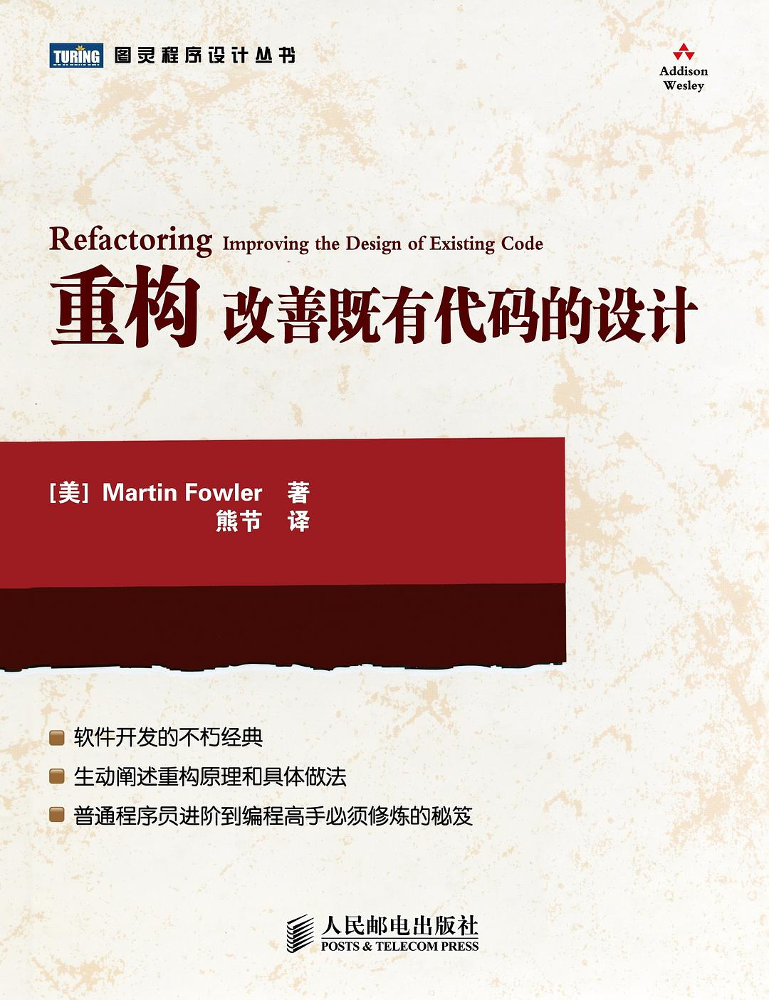
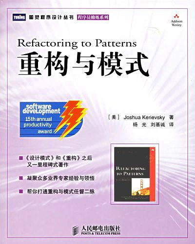

## 设计模式，重构，编程规范相关书籍推荐

#### 设计模式

1. 设计模式

   

   学习设计模式，不知道 GoF 的《设计模式》估计会被人笑话的。这本书是设计模式的开山之作。经典的 23 种设计模式最早就诞生于这本书

2. Head first 设计模式

   

   如果说刚刚提到的《设计模式》是最经典的设计模式书籍，那《Head First 设计模式》就是最通俗易懂的。这本书看起来很厚，但每页里的内容并没有那么密集。这本书最大的特点就是口语化、场景化

#### 编程规范相关

1. 代码整洁之道

   

   这本书非常值得推荐。它主要是讲编码规范，除此之外，还讲到了一些有关设计原则、单元测试、并发编程的东西。因为内容比较侧重编码规范，所以每个知识点都非常明确，能够很容易落地指导你的开发，能够立竿见影地改善你的代码质量。

   

#### 重构相关

1. 重构-改善既有代码的设计

   

   这本书的作者是 Martin Fowler，他写了很多跟软件开发相关的经典书籍。这本《重构》无疑是他最经典的作品。书中讲到了诸多代码的坏味道，并且给出了相应的改进方法，是作者一手开发经验的总结输出。

2. 重构与模式

   

   设计模式一个重要的应用场景就是代码重构。这本书主要讲如何应用设计模式来重构代码，改善代码设计。如果说《重构》是讲如何做低层次的重构，那这本书就是在讲如何做高层次的重构。这本书非常推荐你读一下，它能让你知道，为什么要用设计模式，如何有的放矢地应用设计模式，而非只是无痛呻吟。

3. 修改代码的艺术

   

   如果说《重构》那本书是从编码规范上来讲如何重构，《重构和模式》是从设计模式上来讲如何重构，那这本书可以粗鲁地归为从面向对象设计思想、设计原则上来讲重构。除此之外，这本书更偏向于教你如何来重构，不像上面两本书那样聚焦，所以是一个很好的补充

