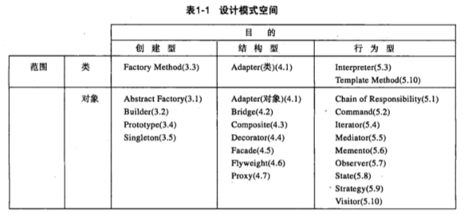
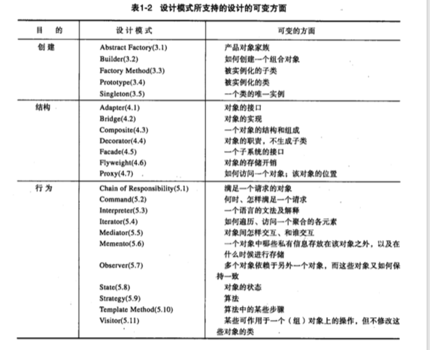
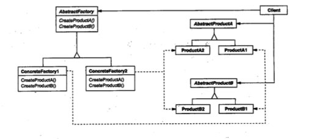
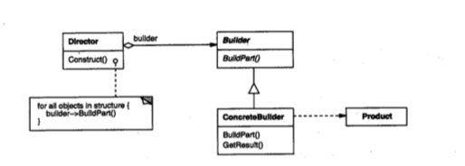

## 第一章 引言

有经验的面向对象的设计者的确能做出良好的设计，而新手则面对众多选择无从下手，**总是求助于以前使用过的非面向对象的技术**

### 设计模式分类



模式依据其目的可分为：

- 创建型模式：与对象的创建有关系
- 结构型模式：处理类或对象的结合
- 行为型模式：对类或者对象怎样交互和怎样分配职责进行描述

依据范围准则：指定模式主要用于类还是对象

- 类模式：处理类和子类之间的关系，这些关系通过继承建立，是静态的，在编译时刻便确定下来了。

- 对象模型：处理对象之间的关系，这些关系在运行时刻是可以改变的，更具动态性。

因此：

- 创建型类模式：将对象的部分创建工作延迟到子类，而创建型对象模式：则将 它延迟到另一个对象中。
- 结构型类模式：使用继承机制来组合类，而结构型对象模式则描述了对象的组装方式。
- 行为型类模式：使用继承描述算法和控制流，而行为型对象模式则描述一组对象怎样协作完成单个对象所无法完成的任务。

显然存在许多组织设计模式的方法。

**动态绑定**：发送给对象的请求和它的相应操作在运行时刻的连接就称之为“动态绑定”，进一步说，动态绑定允许你在运行时刻彼此替换有相同接口的对象。

#### 类继承与接口继承的比较

一个***对象的类***定义了对象是怎样实现的，同时也定义了对象的内部状态和操作的实现。但是***对象的类型***只与它的接口相关，一个对象可以有多个类型，不同类的对象可以有相同的类型。

#### 对接口编程，而不是对实现编程

#### 运用复用机制

- 继承和组合的比较：类继承允许你根据其他类的实现来定义一个类的实现，这种通过生成子类的复用通常被称为“白箱复用”， ”白箱“是相对可视性而言：在集成方式中，父类的内部细节对子类可见

  对象组合是类继承之外的另一种复用选择，对象组合要求被组合的对象具有良好定义的接口。这种复用风格被称为”黑箱复用“，因为对象的内部细节是不可见的。对象只以”黑箱“的形式出现。

  类继承的一些缺点：因为继承在编译时刻就确定了，所以无法在运行时改变从父类继承的实现；更糟的是，父类通常至少定义了部分子类的具体表示；子类的实现与其父类有如此紧密的依赖关系，以至于父类实现中的任何变化必然导致子类发生变化。

  对象组合的优点：运行时动态定义；类和类继承层次会保持较小规模，并且不太可能增长为不可控的庞然大物；基于对象组合的设计会有更多的对象（而有更少的类）

  ***优先使用对象组合，而不是继承***

- 委托：是一种组合方法，它使组合具有与继承同样的复用能力。委托是对象组合的特例。它告诉你对象组合作为一个代码复用机制可以替代继承（在我理解来说，对象组合应该表示可以是多个对象一起来组合，委托一般是一个对象来组合，其实都是组合而已）

- 继承和参数化类型的比较：另一种功能复用技术（并非严格的面向对象技术）是参数化类型，也就是类属或者模板。它允许你在定义一个类型时并不指定该类型所用到的其他所有类型。

对象组合技术允许你在运行时刻改变被组合的行为，但是它存在间接性，比较低效；继承允许你提供操作的缺省实现，并通过子类重定义这些操作；参数化类型允许你改变类所用到的类型。但是继承和参数化类型都不能在运行时刻改变。

#### 下面是一些常见的导致重新设计的原因

1. 通过显式地指定一个类来创建对象

2. 对特殊操作的依赖

3. 对硬件和软件平台的依赖

4. 对对象表示或实现的依赖

5. 算法依赖

6. 紧耦合

7. 通过生成子类来扩充功能

8. 不能方便的对类进行修改

***应用程序 工具箱 框架***：这三者的编写难度依次上升

#### 设计模式与框架的区别

- 设计模式比框架更抽象：框架能够用代码表示，而设计模式只有其实例才能表示为代码

- 设计模式是比框架更小的体系结构元素：一个典型的框架包括了多种设计模式。

- 框架比设计模式更加特例化：框架总是针对一个特定的应用领域。

应用的大部分设计和代码将来自于它所使用的框架或受其影响



## 第二章 实例研究：设计一个文档编辑器

## 第三章 创建型模式

**创建型模式抽象了实例化过程，他们帮助一个系统独立于如何创建，组合和表示它的那些对象**

*一个类创建型模式使用继承改变被实例化的类，而一个对象创建型模式将实例化委托给另一个对象*

下面一个迷宫的demo: *类MapSite是所有迷宫组件的公共抽象类*

```c++
class MapSite{
  public:
  	virtual void Enter() = 0;
}
class Room: public MapSite{
}
class Wall: public MapSite{
}
//表示房间集合的类
class Maze{
}
///MazeGame类创建迷宫，这里是它的一个创建的函数,由2个房子和墙壁，门组成
Maze* MazeGame::CreateMaze (){
  Maze* aMaze = new Maze;
  Room* r1 = new Room(1);
  Room* r2 = new Room(2);
  Door* theDoor = new Door(r1, r2);
  
  aMaze->AddRoom(r1);
  aMaze->AddRoom(r2);
  ///下面是2个房子的构造，东南西北由墙壁和门组成
  r1->setSide(North, new Wall);
  r1->setSide(East, theDoor);
  r1->setSide(South, new Wall);
  r1->setSide(West, new Wall);
  
  r2->setSide(North, new Wall);
  r2->setSide(East, new Wall);
  r2->setSide(South, new Wall);
  r2->setSide(West, theDoor);
}
```

查看上面的CreateMaze代码，真正的问题不在于它的大小，而在于它不灵活，其对迷宫布局进行了硬编码，

*假如修改CreateMaze中迷宫的布局，就会改动一些东西*，这种情况下最大的障碍是对被实例化的类进行了硬编码

- 如果CreateMaze调用虚函数而不是构造器来创建门，房间等，可以创建MazeGame的子类并重新定义这些虚函数，此时是Factory Mathod 模式的例子

- 如果传递一个对象给CreateMaze作参数来创建房间，门等，这是Abstract Factory模式

- 如果传递一个对象给CreateMaze，这个对象可以在它所建造的迷宫里增加房间，门等操作，那么你可以使用继承来改变迷宫的一些部分或者被建造的方式，这是Builder模式

- 如果CreateMaze由多种原型的房间，门对象参数化，它拷贝并将这些对象增加到迷宫中，那么你可以用不同的对象替换这些原型对象以改变迷宫的构成。这是Prototype模式

### 抽象工厂（Abstract Factory）--对象创建型模式

**提供一个*创建一系列相关或者相互依赖对象的接口*，而无需指定它们具体的类**

#### 适用性：在以下情况下可以使用Abstract Factory模式

- 一个系统要独立于它的产品的创建，组合和表示时。

- 一个系统要由多个产品系列中的一个来配置时

- 当要强调一系列相关的产品对象的设计以便进行联合使用时

- 当提供一个产品类库，而只想显示他们的接口而不是实现的时候

#### 结构



#### 效果

优点（1，2，3）和缺点（4）

- 它分离了具体的类：将客户与类的实现分离，客户通过他们的抽象接口操作实例

- 它使得易于交换产品系列：一个具体工厂类在一个应用中仅出现一次，即在它初始化的时候

- 它有利于产品的一致性：当一个系列中的产品被设计成一起工作时，一个应用一次只能使用同一个系列中的对象，这一点很重要，而AbstractFactory很容易实现这一点

- 难以支持新种类的产品：难以扩展抽象工厂以生产新种类的产品

#### 实现

实现Abstract Factory模式的一些有用的技术

- 将工厂作为单件：一个应用中一般每个产品系列只需要要个ConcreteFactory的实例。因此工厂通常最好实现为一个singleton(单件模式)
- 创建产品 Abstract Factory仅声明了创建产品的接口，真正创建产品的由ConcreteProduct实现。最通常的办法是为**每一个产品（非工厂）**定义一个工厂方法（Factory Method）一个具体的工厂将为每个产品重定义该工厂方法以指定产品。*如果有多个可能的产品系列，具体工厂也可以使用Prototype模式来实现*
- 定义可扩展工厂 Abstract Factory通常为每一种它可以生产的产品定义一个操作。增加一个产品要求修改Abstract factory的接口以及所有与其相关的类，一个更灵活但不太安全的操作是给创建对象的操作增加一个参数，该参数指定将被创建的对象的种类

#### 总结

Abstract Factory类通常用工厂方法(Factory Method)实现，但他们也可以使用Prototype实现；一个具体的工厂通常是一个单件

### Builder(生成器)--对象创建型模式

#### 意图

将一个复杂对象的构建与它的表示分离，使得同样的构建过程可以创建不同的表示

#### 适用性

在以下情况下使用Builder模式

- 当创建复杂对象的算法应该独立于该对象的组成部分以及它们的装配方式时

- 当构建过程必须允许被构建的对象有不同的表示时

#### 结构



#### 参与者

- Builder（生成器）： 为创建一个Product对象的各个部件指定抽象接口。
- ConCreteBuilder: 实现Builder的接口以构造和装配该产品的各个部件；
- Director（导向器）： 构建一个使用Builder接口的对象
- Product：表示被构造的复杂对象。

#### 协作

- 客户创建Director对象，并用它所想要的Builder对象进行配置。
- 一旦产品部件被生成，导向器就会通知生成器。
- 客户从生成器中检索产品


#### 效果

- 它使你可以改变一个产品的内部表示
- 它将构造代码和表示代码分开
- 它使你对构造过程进行更精确的控制  **builder与一下子就生成产品的创建型模式不同，它是在导向者的控制下一步一步构造产品的**，仅当产品完成时导向者才从生成器中取回它。因此builder接口相比其他创建型模式能更好的反映产品的构造过程

#### 实现

通常有一个抽象的Builder类为导向者可能要求创建的每一个构件定义一个操作，这些操作缺省下啥都不干。

#### 相关模式

Abstract Factory 与Builder相似，因为它也可以创建复杂对象。主要区别是Builder模式着重于一步步构造一个复杂对象，而Abstract Factory着重于多个系列的产品对象。Builder在最后一步返回产品，而对于Abstract Factory来说，产品是立即返回的。

### Factory Method（工厂方法）--对象创建型模式

#### 意图

定义一个用于创建对象的接口，让子类决定实例化哪一个类。Factory Method使一个类的实例化延迟到其子类。

#### 适用性

- 当一个类不知道它所必须创建的对象的类的时候。
- 当一个类希望由它的子类来指定它所创建的对象的时候。
- 当类将创建对象的职责委托给多个帮助子类中的某一个，并且你希望将哪一个帮助子类是代理者这一信息局部化的时候。

#### 结构


### ProtoType(原型)--对象创建型模式

#### 意图

用原型实例指定创建对象的种类，并通过拷贝这些原型创建新的对象。

### SingleTon(单件)--对象创建型模式

### 创建型模式的讨论

用一个系统创建的那些对象的类对系统进行参数化有两种常见方法。

一种是生成创建对象的类的子类；这对应于使用Factory Method模式；这种方式的主要缺点是，仅为了改变产品类, 就可能需要创建一个新的子类。这样的改变可能是级联的。例如，如果产品的创建者本身是一个工厂方法创建的，那么你也必须重定义它的创建者。

另一种对系统进行参数化的方法更多的依赖于对象复合；定义一个对象负责明确产品对象的类，并将它作为该系统的参数。这是Abstract Factory, Builder, Prototype模式的关键特征。所有这三个模式都涉及到创建一个新的负责创建产品对象的“工厂对象”。Abstract Factory由这个工厂对象产生多个类的对象。Builder由这个工厂对象使用一个相对复杂的协议，逐步创建一个复杂产品。Prototype由该工厂对象通过拷贝原型对象来创建产品对象。

通常，设计以使用Factory Method开始，并且当设计者发现需要更大的灵活性时，设计便会向其他创建型模式演化。

## 第四章 结构型模式

*page 102*

**结构型模式涉及到如何组合类和对象以获得更大的结构**

**结构型对象模式不是对接口和实现进行组合，而是描述了如何对一些对象进行组合，从而实现新功能的一些方法**

### Adapter(适配器)--类对象结构型模式

#### 意图

将一个类的结构转换成客户希望的另外一个接口。Adapter 模式使得原来接口不兼容而不能一起工作的那些类可以一起工作。

#### 动机

假如我们需要客户要调用的接口是shape，然后我们的功能的实现类是textview，这样因为接口的不一致，就需要Adapter模式了，可以使用两种方式（这两种在java中可能就是一种了）：1：TextShape继承Shape类的接口和textView的实现。2：或者将一个textView实例作为TextShape的组成部分，并且使用textView的接口来实现TextShape。 这两种方式恰恰对应于Adapter模式的类和对象版本。我们称TextShape为适配器Adapter

#### 适用性

- 你想使用一个已经存在的类，而它的接口不符合你的需求
- 你想创建一个可以复用的类，该类于其他不相关的类或不可预见的类（即那些接口可能不一定兼容的类）协同工作。
- （仅适用于对象Adapter）你想使用一些已存在的子类，但是不可能对每一个都进行子类化以匹配他们的接口。对象适配器可以适配它的父类接口

#### 结构


#### 效果

类适配器和对象适配器不同的权衡，类适配器有

- 用一个具体的Adapter类对Adaptee和target进行匹配。结果是当我们想要匹配一个类以及所有它的子类时，类Adapter将不能胜任

- 试的Adapter可以重新定义Adaptee的部分行为。因为Adapter是Adaptee的一个子类

- 仅仅引入了一个对象，并不需要额外的指针以间接得到adaptee

对象适配器

- 允许一个Adapter与多个Adaptee---即Adaptee本身以及它的所有子类一同时工作
- 使得重新定义Adaptee的行为比较困难。这就需要生成Adaptee的子类并且使得Adapter引用这个子类而非Adaptee本身

#### 相关模式

模式Bridge的结构与对象适配器类似，但是Bridge模式的出发点不同：Bridge目的是将接口部分与实现部分分离，从而对他们可以较容易也相对独立的加以改变。而Adapter则意味着改变一个已有对象的接口。

### Bridge（桥接）--对象结构型模式

*page 111*

#### 意图

将抽象部分与它的实现部分分离，使他们都可以独立的变化

#### 动机

当一个抽象可能有多个实现时，通常用继承来协调他们。抽象类定义抽象接口，而具体的子类则用不同方式加以实现。但是此方法有时候不够灵活。继承机制将抽象部分和它的实现部分绑定在了一起，使得难以对抽象部分和实现部分独立的进行修改，扩充和重用。

#### 适用性

以下一些情况适用Bridge模式

- 你不希望在抽象和它的实现部分之间有一个固定的绑定关系，例如这种情况可能是因为，在运行时刻 实现部分 应该可以被选择或者切换（这里我理解的相当于用组合来替换继承的方式，实现运行时切换）。
- 类的抽象以及它的实现都应该通过生成子类的方法加以扩充。这时Bridge模式使你可以对不同的抽象接口和实现部分进行组合，并分别对他们进行扩充。
- 对一个抽象的实现部分的修改对客户不产生影响，即客户代码不必重新编译。

#### 结构


#### 效果

- 分离接口和实现部分：一个实现未必不变的绑定在一个接口上
- 提高可扩充性
- 实现细节对客户透明

#### 相关模式

Abstract Factory 模式可以用来创建和配置（也就是上图中Implementer的部分）一个特定的Bridge模式

### Composite(组合)--对象结构型模式

*page 118*  

#### 意图

将对象组合成树形结构以表示“部分-整体“的层次结构。Composite使得用户对单个对象和组合对象的使用具有一致性

#### 适用性

- 你想表示对象的部分-整体层次结构
- 你希望用户忽略组合对象和单个对象的不同，用户统一地使用组合结构中的所有对象

#### 结构


（感觉是装饰者模式和组合模式的结合体~）

#### 效果

- 定义了包含基本对象和组合对象的类层次结构  基本对象可以被组合成更复杂的组合对象，而这个组合对象又可以被组合，这样不断的递归下去。
- 简化客户代码  客户可以一致的使用组合结构和单个对象。
- 使得更容易增加新类型的组件
- 使你的设计变得更加一般化

#### 相关模式

Decorator模式（装饰者模式）经常和Composite模式一起使用，当装饰和组合一起使用时，它们通常有一个公共的父类。

通常”部件-父部件“连接用于Responsibility of Chain 模式

### Decorator(装饰)-对象结构型模式

*page126*

#### 意图

动态地给一个对象添加一些额外的职责，而不是对整个类添加一些功能。别名 包装器wrapper

#### 适用性

- 在不影响其他对象的情况下，以动态，透明的方式给单个对象添加职责
- 处理那些可以撤销的职责
- 当不能采用生成子类的方法进行扩充时候。

#### 结构


#### 效果

有2个优点

1. 比静态继承更灵活 与对象的静态继承（多重继承）
2. 避免在层次结构高层的类有太多的特性

2个缺点

1. Decorator与它的Component不一样
2. 有许多小对象

#### 实现

- 接口一致性 装饰对象的接口必须与它所装饰的Component的接口是一致的
- 省略抽象的Decorator类 当你仅需要添加一个职责时，没有必要定义抽象Decorator类。
- 保持Component类的简单性 为了保证接口的一致性，组件和装饰必须有一个公共的Component父类。因此保持这个类的简单性是很重要的；即它应集中于接口而不是存储数据
- 改变对象外壳与改变对象内核  我们可以将Decorator看作一个对象的外壳，它可以改变这个对象的行为。另外一种方法是改变对象的内核。如Strategy（策略模式）就是一个用于改变内核的很好的模式， 当Component类原本就很庞大时，使用Decorator模式代价太高，Strategy模式相对更好一些。

#### 相关模式

Adapter模式： Decorator模式不同于Adapter模式。因为装饰仅改变对象的职责而不改变它的接口。而适配器给对象一个全新的接口

Composite模式：可以讲装饰视为一个退化的，仅有一个组件的组合，然而，装饰仅给对象添加一些额外的职责。它的目的不在于对象聚集

Strategy模式：用一个装饰你可以改变对象的外表；而Strategy模式使得你可以改变对象的内核。这是改变对象的两种途径

### Facade(外观)-对象结构型模式

*page133*

#### 意图

为子系统中的一组接口提供一个一致的界面，Facade模式定义了一个高层接口，这个接口使得这一子系统更加容易使用。

#### 动机

将一个系统划分为若干个子系统有利于降低系统的复杂性，一个常见的设计目标是使子系统间的通信和相互依赖关系达到最小。达到该目标的途径之一就是引入一个外观对象，它为子系统中较一般的设施提供了一个单一而简单的界面。

#### 适用性

- 当你要为复杂系统提供一个简单接口的时候。
- 客户程序与抽象类的实现部分之间存在着很大的依赖性时
- 当你需要一个层次结构的子系统时，使用Facade模式定义子系统中每层的入口点。如果子系统之间是相互依赖的，你可以让它们仅通过facade进行通讯，从而简化它们的依赖的关系。

#### 结构


#### 实现

实现Facade模式时需注意以下几点

- 降低客户-子系统之间的耦合度 用抽象类实现Facade而它的具体子类对应于不同的子系统实现，这可以进一步降低客户与子系统的耦合度。
- 通常来讲，仅需要一个Facade对象，因此Facade对象通常属于Singleton模式

### FlyWeight(享元)-对象结构型模式

*page139*

#### 意图

运用共享技术有效地支持大量细粒度的对象，FlyWeight模式对那些通常因为数量太大而难以用对象来表示的概念或实体进行建模。

#### 适用性

- 一个应用程序使用了大量的对象
- 完全由于使用大量的对象，造成很大的存储开销
- 对象的大多数状态都可变为外部状态。

### Proxy（代理）- 对象结构型模式

#### 意图

为其他对象提供一种代理以控制对这个对象的访问

#### 适用性

- 远程代理（Remote Proxy）为一个对象在不同的地址空间提供局部代表
- 虚代理（Virtual Proxy）根据需要创建开销很大的对象。
- 保护代理（Protection Proxy）控制对原始对象的访问。保护代理用于对象应该有不同的访问权限的时候

#### 结构


#### 相关模式

Adapter适配器为它所适配的对象提供一个不同的接口。相反，代理提供了与它的实体相同的接口。

Decorator装饰者尽管实现部分与代理相似，但decorator的目的不一样。Decorator为对象添加一个或多个功能，而代理则控制对对象的访问。Remote Proxy不包含对实体的直接引用，而只是一个间接引用，如“主机ID，主机上的局部地址”等


## 第五章 行为模式

*page158*

### chain of responsibility（职责链）-对象行为型模式

#### 意图

使多个对象都有机会处理请求，从而避免请求的发送者和接收者之间的耦合关系。将这些对象连成一条链，并沿着这条链传递该请求，直到有一个对象处理它为止

#### 适用性

- 有对个对象可以处理一个请求，哪个对象处理该请求运行时刻自动确定
- 你想在不明确指定接收者的情况下，向多个对象中的一个提交一个请求。
- 可处理一个请求的对象集合应被动态指定

#### 结构


#### 效果（优点和缺点）

- 降低耦合性  该模式使得一个对象无需知道是其他哪一个对象处理其请求，对象仅须知道该请求会被正确的处理
- 增强了给对象指派职责的灵活性 当在对象中分派职责时，职责链给你更多的灵活性。你可以在运行时刻对该链进行动态的增加或修改来处理那些职责
- 不保证被接收 既然一个请求没有明确的接收者，那么就不能保证它一定会被处理，该请求可能一直到链的末端都得不到处理。

#### 相关模式

职责链常与Composite一起使用。

### Command（命令）-对象行为型模式

*page166*

#### 意图

将一个请求封装为一个对象，从而使你可用不同的请求对客户进行参数化；对请求排队或记录请求日志，以及支持可撤销的操作。使命令的发送者和命令的真实执行者解耦

#### 适用性

当有如下需求时，可使用Command模式

- 抽象出待执行的动作以参数化某对象。
- 在不同的时刻指定，排列和执行请求。一个command对象可以有一个与初始请求无关的生存期。如果一个请求的接收者可用一种与地址空间无关的方式表达，那么就可将负责该请求的命令对象传送给另一个不同的进程并在那儿实现该请求。
- 支持取消操作。Command的Execute操作可在实施操作前将状态存储起来，在取消操作时这个状态用来消除该操作的影响。Command接口需要添加一个UnExecute的操作来取消
- 支持修改日志，当系统崩溃时，这些修改可以被重做一遍。

#### 结构


### Interpreter(解释器)-类行为型模式

*page172*

#### 意图

给定一个语言，定义它的文法的一种表示，并定义一个解释器，这个解释器使用该表示来解释语言中的句子

### Iterator(迭代器)-对象行为型模式

#### 意图

提供一种方法顺序访问一个聚合对象中各个元素，而又不需要暴露该对象的内部表示

#### 适用性

迭代器模式可用来：

- 访问一个聚合对象的内容而无需暴露它的内部表示
- 支持对聚合对象的多种遍历
- 为遍历不同的聚合结构提供一个统一的接口

#### 结构


#### 参与者

- Iterator（迭代器）：迭代器定义访问和遍历元素的接口
- ConcreteIterator(具体迭代器)
- Aggregate（聚合）：定义创建相应迭代器对象的接口
- ConcreteAggregate(具体聚合)：具体实现创建迭代器的接口

#### 效果

- 它支持以不同的方式遍历一个聚合
- 迭代器简化了聚合的接口
- 在同一个聚合上可以有多个遍历

**内部迭代器，外部迭代器**

#### 相关模式

Composite：迭代器常被应用到像复合这样的递归结构上。

Factory Method: 多态迭代器靠Factory Method来例化适当的迭代器子类

### Mediator（中介者）-对象行为型模式

#### 意图

用一个中介对象来封装一系列的对象交互。中介者使各个对象不需要显式的相互调用，从而使其耦合松散，而且可以独立的改变他们之间的交互

#### 适用性

- 一组对象以定义良好但是复杂的方式进行通信。产生的相互依赖关系结构混乱且难以理解
- 一个对象引用其他的很多对象并且直接与这些对象通信，导致难以复用该对象。
- 想定制一个分布在多个类中的行为，而又不想生成太多的子类

#### 结构


Mediator：中介者： 定义接口用于与个同事对象通信

ConcreteMediator：具体中介者，通过协调各同事对象实现协作行为，了解并维护他的各种同事

Colleague：同事类，每个同事类都知道他的中介者对象。每个同事对象在需要与其他的同事通信时，与它的中介者通信

同事向一个中介者对象发送和接收请求。中介者在各个同事间适当的转发请求以实现协作行为。

#### 相关模式

Facade模式与中介者的不同之处在于它是对一个对象子系统进行抽象，从而提供了一个geng为方便的接口，它的协议是单向的，即Facade对象对子系统提出请求， 但是反之则不行。相反，Mediator提供了各个Colleague对象不支持或不能支持的协作行为，而且协议是多向的。

Colleague可使用Observer模式与Mediator通信。

### Memento(备忘录)-对象行为型模式

*page199*

#### 意图

在不破坏封装性的前提下，捕获一个对象的内部状态，并在该对象之外保存这个状态，这样以后就可以将该对象恢复到原先保存的状态

#### 适用性

在以下情况下使用备忘录模式：

- 必须保存一个对象在某个时刻的状态，这样以后需要时它才能恢复到先前的状态
- 如果一个用接口来让其他对象直接得到这些状态，将会暴露对象的实现细节并破坏对象的封装性

#### 结构


**Memento**:备忘录，存储源发器对象的内部状态，源发器根据需要决定备忘录存储源发器的哪些内部状态；防止源发器以外的其他对象访问备忘录

**Originator**:源发器，创建一个备忘录，用以记录当前时刻它的内部状态。

**Caretaker**：负责人，负责保存好备忘录，不能对备忘录的内容进行操作或检查

#### 协作


- 管理器向源发器请求一个备忘录，保留一段时间后，将其送回给源发器
- 备忘录是被动的。只有创建备忘录的源发器会对它的状态进行赋值和检索

#### 效果

- 保持封装边界：使用备忘录可以避免暴露一些只应由源发器管理却又必须存储在源发器之外的信息。该模式把复杂的Originator内部信息对其他对象屏蔽起来，从而保持了封装边界
- 它简化了原发器
- 使用备忘录可能代价很高 ：如果原发器在生成备忘录时必须拷贝并存储大量的信息，或者客户非常频繁的创建备忘录和恢复源发器状态，可能导致非常大的开销。*除非封装和恢复Originator状态的开销不大，否则该模式可能并不合适*

#### 相关模式

Command：命令可使用备忘录来为可撤销的操作维护状态

Interator：如前所述，备忘录可用于迭代。

### Observer（观察者）-对象行为型模式

*page205*

### 意图

定义对象间的一种一对多的依赖关系，当一个对象的状态发生改变时，所有依赖于它的对象都得到通知并被自动更新

### 适用性

- 当一个抽象模型有两个方面，其中一个方面依赖于另一个方面。将这二者封装在独立的对象中以使它们可以各自独立地改变和复用
- 当对一个对象的改变需要同时改变其他的对象，而不知道具体有多少对象有待改变。
- 当一个对象必须通知其他的对象，而它又不能假定其他对象是谁；换言之，你不希望这些对象是紧密耦合的。

### 结构


### 参与者

- Subject（目标）：目标知道它的观察者，可以有任意多个观察者观察同一个目标，并且提供注册和删除观察者对象的接口
- Observer（观察者）：为那些在目标发生改变时需获得通知的对象定义一个更新接口
- ConcreteSubject（具体目标）：
- ConcreteObserver(具体观察者)：维护一个指向ConcreteSubject对象的引用。

### STATE（状态）--对象行为型模式

#### 意图

允许一个对象在其内部状态改变时改变它的行为。对象看起来似乎修改了它的类

别名为 状态对象

#### 适用性

在下面的情况下均可使用State模式：

- 一个对象的行为取决于它的状态，并且它必须在运行时刻根据状态改变它的行为
- 一个操作中含有庞大的多分支的条件语句，且这些分支依赖于该对象的状态。这个状态通常用一个或多个枚举常量表示。

#### 结构


#### 实现

实现State模式有多方面的考虑：

- **谁定义状态转换**  State模式不指定哪一个参与者定义状态转换准则。如果该准则是固定的，那么它们可在Context中完全实现。然而若让state的子类自身指定它们的后继状态以及何时进行转换，通常更灵活更合适，但是这样的一个缺点是，一个state子类至少拥有一个其他的子类的信息，这就在各子类之间产生了实现依赖
- **基于表的另一种方法** 
- **创建和销毁State对象** 一个常见的权衡是：1.仅当需要State对象时才创建它们并随后销毁它们。2.提前创建它们并且始终不销毁它们。

### STRATEGY（策略）--对象行为型模式

*page219*

#### 意图

定义一系列的算法，把它们一个个封装起来，并且使它们可相互替换。本模式使算法可独立于使用它的客户而改变

#### 结构


### Template Method(模板方法)--类行为型模式

*page 225*

#### 意图

定义一个操作中的算法的骨架，而将一些步骤延迟到子类中。TemplateMethod使得子类可以不改变一个算法的结构即可重定义该算法的某些特定步骤

#### 适用性

模板方法应用于下列情况

- 一次性实现一个算法的不变的部分，并将可变的行为留给子类来实现。
- 各子类中公共的行为应被提取出来并集中到一个公共父类中以避免代码重复。
- 控制子类扩展。模板方法只在特定点调用“hook”操作，这样就只允许在这些点进行扩展。

#### 结构


#### 效果

**钩子操作**：它提供缺省的行为，子类可以在必要时进行扩展。一个钩子操作在缺省操作时通常是一个空操作。

很重要的一点是模板方法应该指明哪些操作是**钩子操作（可以被重定义）以及哪些是抽象操作（必须被重定义）**。要有效的重用一个抽象类，子类编写者必须明确了解哪些操作是设计为有待重定义的。

子类可以通过重定义父类的操作来扩展该操作的行为，其间可显示地调用父类操作。

```c++
void DerivedClass::Operation(){
  ParentClass::Operation();
  //DerivedClass extended behavior
}
```

**不幸的是，人们很容易忘记去调用被继承的行为。**我们可以将这样一个操作转换为一个模板方法，以使得父类可以对子类的扩展方式进行控制。也就是，在父类的模板方法中调用钩子操作。子类可以重定义这个钩子操作：

```c++
void ParentClass::Operation(){
  // ParentClass behavior
  
  ////
  HookOperation();
}
```

然后子类重新定义HookOperation以扩展行为

### Visitor（访问者）--对象行为型模式

*page229*

#### 意图

表示一个作用于某对象结构中的各元素的操作。它使你可以在不改变各元素的类的前提下定义作用于这些元素的新操作

#### 适用性

在下面情况下使用visitor模式

- 一个对象结构包含很多类对象，他们有不同的接口，而你想对这些对象实施一些依赖于其具体类的操作。
- 需要对一个对象结构中的对象进行很多不同的并且不相关的操作，而你想避免让这些操作 污染 这些对象的类
- 定义对象结构的类很少改变，但是经常需要在此结构上定义新的操作

#### 结构


#### 效果

- 访问者模式使得易于添加新的操作：仅需增加一个新的访问者即可在一个对象结构上定义一个新的操作
- 访问者集中相关的操作而分离无关的操作
- 增加新的ConcreteElement类很困难：Visitor模式使得难以增加新的Element的子类。

### 行为模式的讨论（重要）

**封装变化**：当一个程序的某个方面的特征经常发生改变时， 这些模式就定义一个封装这个方面的对象。

**对象作为参数**：一些模式引入总是被用作参数的对象，如Visitor模式

**通信应该被封装还是被分布**：Mediator和Observer是相互竞争的模式。它们之间的差别是，Observer通过引入Observer和Subject对象来分布通信，而Mediator对象则封装了其他对象之间的通信

**对发送者和接收者解耦**：命令，观察者，中介者和职责链等模式都涉及如何对发送者和接收者解耦，但它们又各有不同的考虑。

命令模式使用一个command对象来定义一个发送者和一个接收者之间的绑定关系，从而支持解耦

观察者模式通过定义一个接口来通知目标中发生的改变，从而将发送者（目标）与接收者（观察者）解耦

中介者模式（Mediator）让对象通过一个Mediator对象间接的互相引用，从而对它们解耦。

职责链模式通过沿一个潜在接收者链传递请求而将发送者与接收者解耦

## 第六章 结论

*page243*


