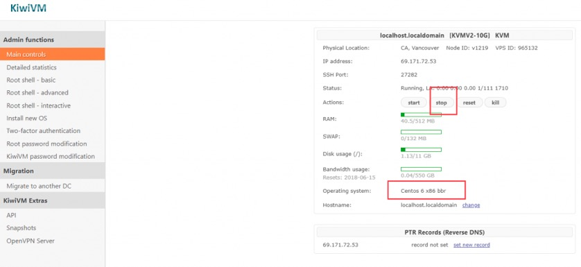
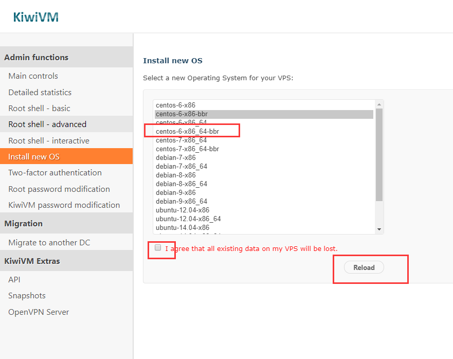
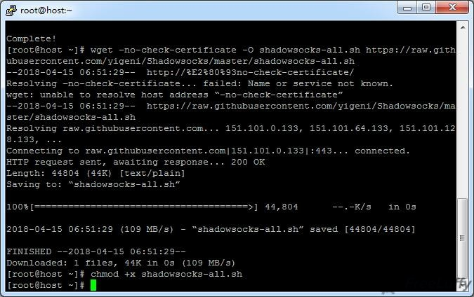
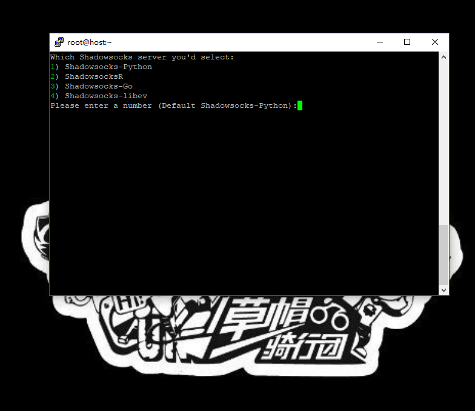
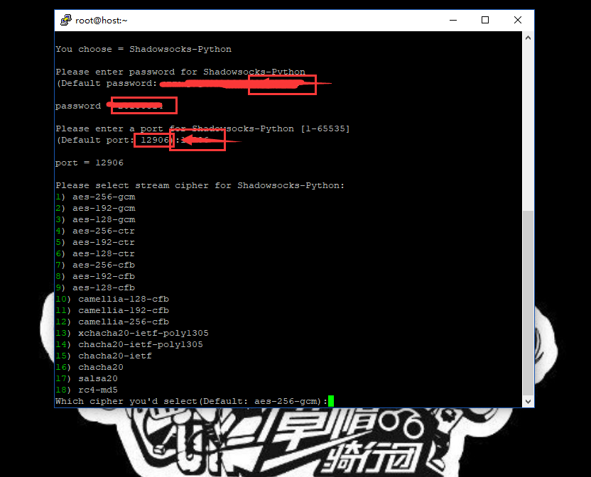
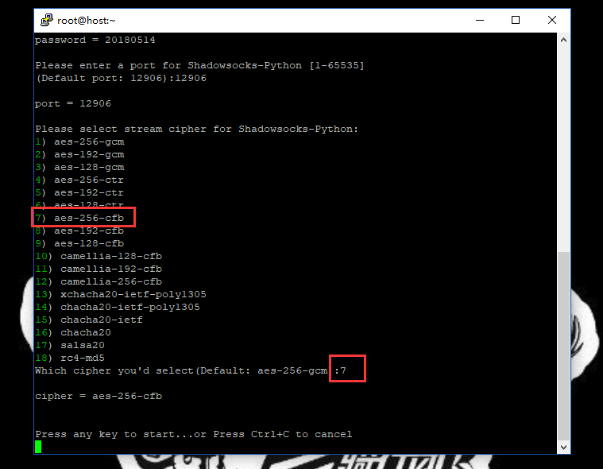
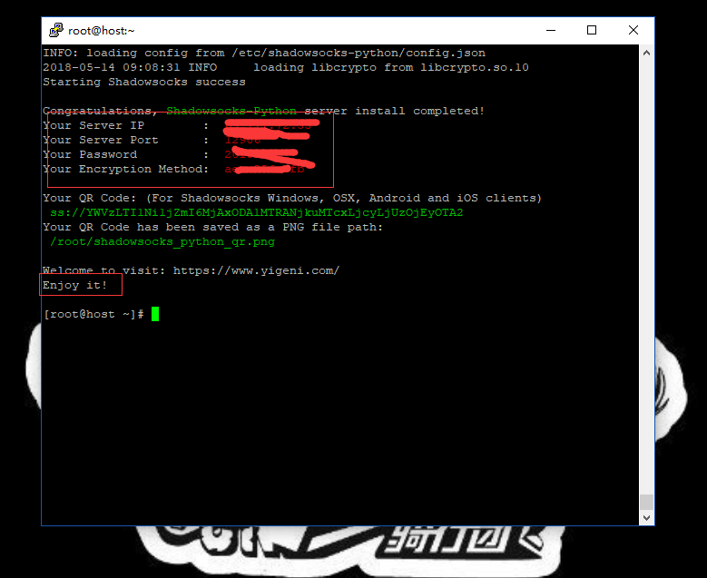

## 搬瓦工的详细配置

无论工作还是生活中，我们都需要使用互联网。但有时候遇到问题时，度娘实在不给力，而谷歌又无法访问。但没关系，有问题就有解决的方法！所以小编就教教大家如何使用版搬瓦工来搭建SS服务器，带你畅游全网！"

#### 进入搬瓦工官网购买VPS

在搭建SS之前你需要准备一台境外VPS服务器。所以今天我们的主角之一：搬瓦工VPS要登场了！按照个人的需求，点击下面连接进入选配：
点击这里进入搬瓦工bandwagonhost官网
搬瓦工10G VPS（KVM架构）$19.99/年
基本配置-SSD：10G | 内存：512M | CPU：1x Intel Xeon | 流量：500G/月 | 链接速度：1千兆
搬瓦工20G VPS（KVM架构）$49.99/年
基本配置-SSD：20G | 内存：1G | CPU：2x Intel Xeon | 流量：1TB/月 | 链接速度：1千兆
更多搬瓦工VPS选择（KVM架构）$19.99/年起
可灵活自由选择各种配置以及支付结算方式。

#### 选择一台合适的服务器
因为只是搭建SS，所以配置不用太高，19.99美元/年的KVM完全OK,按照目前的汇率，大约等于128人民币，已经是超值了,当然,土豪请随意！确认下计费方式就是19.99美元/1年没错,然后选择机房位置，当然离中国近点会稍微稳定点，推荐洛杉矶吧，其实相差不大。

## 获取服务器后台信息

进入你刚才购买的服务器控制面板,确认下服务的具体配置操作系统什么的.

我们搭建SS需要的最佳系统环境是[Centos 6 x86_64-bbr],所以需要你点击[stop],然后下一步咱们重选系统.

点击左侧菜单[Install new OS],勾选同意,然后点金按钮[Reload].稍等片刻.

这个页面不要关掉了!因为以下就是你的VPS-root权限密码和端口号。在接下来搭建SS服务器的过程中会用到!

其实搭建SS服务器并没有大家想象的那么难，一共只需三行命令而已，但是考虑到有很多小白用户，我每一步都会去截图说明。
首先,你要下载一个软件:Putty。下载好之后，打开Putty，输入上面搬瓦工后台的服务器IP以及端口，然后点【Open】。
[点击这里下载Putty](https://pan.baidu.com/s/13p39wsC58im99nxYKOyQzA)

这里有对话框弹出，选择“是”。

然后在命令窗输入“root”，敲打回车键。等几秒秒，并按照按提示输入主机root的密码，密码就是前面记录的VPS密码。复制你的密码，粘贴至Putty命令窗（**粘贴方式为单击鼠标右键，只需要右键单击一次，这里不会显示任何内容，其实是已经输入了**），回车。

特别提醒：Putty命令窗的粘贴方式为【鼠标右键单机一次】，所以以下凡是涉及粘贴都要这样操作！×关闭警报

等到出现“[root@host ~]#”，复制下面脚本第1条命令，回车：

wget –no-check-certificate -O shadowsocks.sh https://raw.githubusercontent.com/teddysun/shadowsocks_install/master/shadowsocks.sh

需要注意的是这一步有时会出现“bash: wget: command not found”：的问题，如下图所示：

不过不要紧张，国外的服务器会有时出现这种情况（亲测搬瓦工偶尔会出现，但是Vultr就不会）。
解决方法：可以请先执行“yum -y install wget”命令，成功后，再执行上面的命令。（如果没有出现请无视）

看到上图时，咱们接着继续，执行第2条脚本命令，回车：

chmod +x shadowsocks.sh

等出现了上图后，输入第3条脚本命令，回车：

./shadowsocks.sh 2>&1 | tee shadowsocks.log

以上选择”1“，然后回车；

这一步就是输入你的密码-确认密码，输入对应的端口号-确认端口号。

这一步是选择加密方式，我们输入”7“，然后回车。
接下来就需要几分钟的安装时间，你可以起身上个厕所或者吃个苹果什么的- -

当你看到以上画面时，恭喜！你已经完成了ss服务的搭建。接下来好好使用你的ss账号享受网上冲浪吧，哈哈！

#特别提醒#切记一定要好好保存以上信息：Server IP（服务器IP）、Server Port（服务器端口）、Password（密码）、Encryption Method（加密方式），因为之后你用任何设备在任何平台翻墙都需要填写这些信息！好了，既然你已经拿到通往新世界的船票了，下面一步将教你如何上船！×关闭警报

到了这一步，也就是说你已经拥有了“翻墙”的权限了，然后需要知道的是如何利用软件和APP来实现翻墙上网。接下来就讲一下四大主流平台的翻墙方法。
WINDOWS 电脑用户
直接下载 shadowsocks：百度网盘。
下载之后解压就能用(部分电脑需要安装.NET)，打开 shadowsocks.exe 会看到通知栏有一个纸飞机图标，双击它！

ANDROID 手机用户
直接在手机应用商店搜索下载： Shadowsocks。找不到也没关系，我也上传到网盘了了，点击下载：百度网盘。
打开手机SS客户端，点击右上角+号，选择手动设置。

在弹出页面中填写你的SS服务器IP、远程端口、密码、加密方式，点击对号保存，如图：
IPHONE 手机用户
相对微软和安卓来讲，苹果翻墙会比较麻烦点。需要一些特定的APP，目前已知的有Shadowrocket(2.99美元)、FirstWingy(0.99美元)、Wingy(0.99美元)等等，但是这些APP在国内商店是没有的。所以你还需要注册一个美国版苹果ID来配合下载使用。关于如何注册美国版苹果ID，请参考：如何注册美国苹果ID。
MAC OS用户
直接下载：ShadowsocksX-NG。如果旧版本不能用，可自行去下载最新版本：“https://github.com/shadowsocks/ShadowsocksX-NG/releases”。
点击这里下载ShadowsocksX-NG
